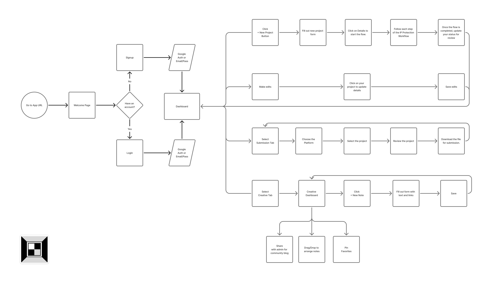
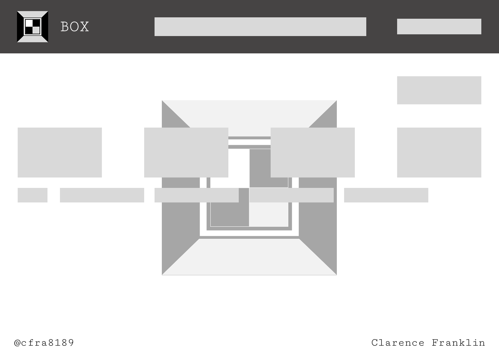
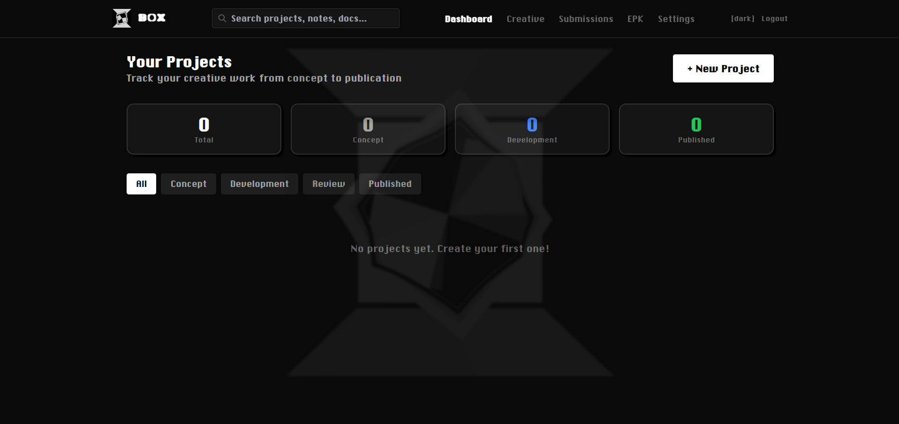

# THE BOX - Final Project Proposal




## 1. Application Name
**The Box**

---

## 2. Application Description

### Overview
The Box is a music business administration platform designed specifically for independent music artists. It serves as a centralized hub for managing the administrative and legal aspects of music creation, ensuring artists maintain proper documentation, protect their intellectual property, and stay organized throughout their creative journey.

### Core Purpose
The Box solves the critical challenge of music business administration for independent artists by providing:
- **Project & Release Management**: Track music projects from creation to release, organize sessions, and manage production workflows
- **Document Organization**: Secure storage and management of contracts, splits sheets, copyright registrations, and licensing agreements  
- **Administrative Tracking**: Keep track of royalty splits, publishing rights, master ownership, and collaboration agreements
- **Legal Protection**: Ensure all documentation is accessible and organized for copyright claims, disputes, or audits

### Target Users
- Independent music artists (rappers, singers, producers, songwriters)
- Artist managers
- Small record labels
- Music collectives

### Key Features

#### 1. Project Management
- Create and organize music projects (singles, EPs, albums, features)
- Track production status and release dates
- Manage collaborators and contributors per project

#### 2. Document Vault
- Upload and store contracts, splits sheets, and agreements
- Organize copyright registrations and publishing documentation
- File management system with search and filtering
- Download files for submission or legal purposes

#### 3. Creative Dashboard
- Visual note-taking for song ideas and references
- Drag-and-drop organization for creative workflow
- Pin important notes and links
- Share creative process with community (optional blog feature)

#### 4. Distribution & Submission Tracker
- Track submissions to streaming platforms, playlists, blogs
- Manage distribution platform information
- Review submission history and outcomes

#### 5. User Authentication & Profiles
- Secure Google Auth or Email/Password login
- Personalized dashboard
- Artist profile and portfolio

---

## 3. Backend Route Tree

```
/api/auth
  POST   /register          # Create new user account
  POST   /login            # User login
  POST   /logout           # User logout
  GET    /verify           # Verify JWT token

/api/users
  GET    /profile          # Get current user profile
  PUT    /profile          # Update user profile
  DELETE /profile          # Delete user account

/api/projects
  GET    /                 # Get all projects for user
  GET    /:id              # Get single project by ID
  POST   /                 # Create new project
  PUT    /:id              # Update project details
  DELETE /:id              # Delete project
  PATCH  /:id/status       # Update project status

/api/documents
  GET    /                 # Get all documents for user
  GET    /:id              # Get single document
  POST   /                 # Upload new document
  PUT    /:id              # Update document metadata
  DELETE /:id              # Delete document
  GET    /project/:projectId  # Get all documents for a project

/api/creative
  GET    /notes            # Get all creative notes
  GET    /notes/:id        # Get single note
  POST   /notes            # Create new note
  PUT    /notes/:id        # Update note
  DELETE /notes/:id        # Delete note
  POST   /notes/:id/pin    # Pin/unpin favorite
  GET    /favorites        # Get pinned favorites

/api/submissions
  GET    /                 # Get all submissions for user
  GET    /:id              # Get single submission
  POST   /                 # Create new submission
  PUT    /:id              # Update submission
  DELETE /:id              # Delete submission
  GET    /platforms        # Get available platforms
  POST   /platforms        # Add custom platform

/api/uploads
  POST   /                 # Upload file (documents, contracts, media)
  DELETE /:id              # Delete uploaded file
```

---

## 4. Entity Relationship Diagram (ERD)

### Database Tables & Relationships

#### **Users**
```
- id (PK)
- email (unique)
- password_hash
- display_name
- artist_name
- auth_provider (google/email)
- created_at
- updated_at
```

#### **Projects**
```
- id (PK)
- user_id (FK -> Users)
- title
- project_type (single/EP/album/feature/other)
- status (writing/recording/mixing/mastering/released)
- release_date
- collaborators (JSON or separate table)
- created_at
- updated_at
```

#### **Documents**
```
- id (PK)
- user_id (FK -> Users)
- project_id (FK -> Projects, nullable)
- document_name
- document_type (contract/split_sheet/copyright/license/other)
- file_url (cloud storage path)
- file_size
- upload_date
- notes
- created_at
- updated_at
```

#### **Creative_Notes**
```
- id (PK)
- user_id (FK -> Users)
- title
- content (rich text)
- note_type (lyric_idea/beat_reference/inspiration/draft)
- is_pinned (boolean)
- position_x (for drag-drop)
- position_y (for drag-drop)
- created_at
- updated_at
```

#### **Note_Links**
```
- id (PK)
- note_id (FK -> Creative_Notes)
- url
- link_type (youtube/spotify/soundcloud/image/article)
- created_at
```

#### **Submissions**
```
- id (PK)
- project_id (FK -> Projects)
- platform_id (FK -> Platforms)
- submission_date
- status (pending/accepted/rejected/under_review)
- deadline
- notes
- created_at
- updated_at
```

#### **Platforms**
```
- id (PK)
- name (e.g., "Spotify", "Apple Music", "SubmitHub")
- platform_type (streaming/distribution/playlist/blog)
- website_url
- is_custom (boolean - user-added vs. pre-populated)
- created_by (FK -> Users, nullable)
- created_at
```

### ERD Relationships
- Users **1:M** Projects (one user has many projects)
- Users **1:M** Documents (one user has many documents)
- Projects **1:M** Documents (one project has many documents)
- Users **1:M** Creative_Notes (one user has many notes)
- Creative_Notes **1:M** Note_Links (one note has many links)
- Projects **1:M** Submissions (one project has many submissions)
- Platforms **1:M** Submissions (one platform has many submissions)

---

## 5. Project Timeline

### Sept 7, 2025 - Project started
- Sept-Oct 2025 - Initial development and planning
- Nov-Dec 25, 2025 - Development pause
- Dec 26, 2025 - Resumed development
- Jan 2026 - Continued feature development
- Feb 2026 - Began applying MERN stack skills - Built out full-stack architecture with MongoDB/Express/React/Node, implemented authentication, API routes, database models, and React components
- Feb 6-10, 2026 - Testing, debugging, optimization
- Feb 11-12, 2026 - Final polish and deployment prep
- Feb 13, 2026 - Project completion

### Major Milestones Achieved
- ✅ User authentication (Google OAuth + Email/Password)
- ✅ Project CRUD operations
- ✅ Document upload and management system
- ✅ Creative dashboard with notes
- ✅ Submission tracking
- ✅ Responsive UI design
- ✅ Deployment ready

---

## 6. Technology Stack

### Frontend
- React.js
- TailwindCSS for styling
- React Router for navigation
- React DnD (drag-and-drop) for Creative Dashboard
- Axios for API calls

### Backend
- Node.js
- Express.js
- PostgreSQL (database)
- JWT for authentication
- Passport.js (Google OAuth)
- Multer + AWS S3/Cloudinary (file uploads)

### Deployment
- Frontend: Vercel or Netlify
- Backend: Render or Railway
- Database: Supabase or ElephantSQL

---

## 7. MVP Features - COMPLETED ✅

- ✅ User authentication (email/password + Google OAuth)
- ✅ Create, read, update, delete music projects
- ✅ Track project status and release dates
- ✅ Document upload and management (contracts, splits sheets, etc.)
- ✅ Creative notes with text and embedded links
- ✅ Submission tracking (platforms, dates, status)
- ✅ User dashboard showing all projects and documents
- ✅ File organization by project

---

## 8. Additional Features Implemented

- Search and filter functionality for documents
- Drag-and-drop interface for creative notes
- Pin important notes to top of dashboard
- Project collaborator tracking
- Custom platform additions for submissions
- Responsive mobile design

---

## Project Information

**Project Start Date**: September 7, 2025,

**MERN Stack Application**: February 2026,

**Project Completion Date**: February 13, 2026,

**Total Development Time**: ~4.5 months
---

